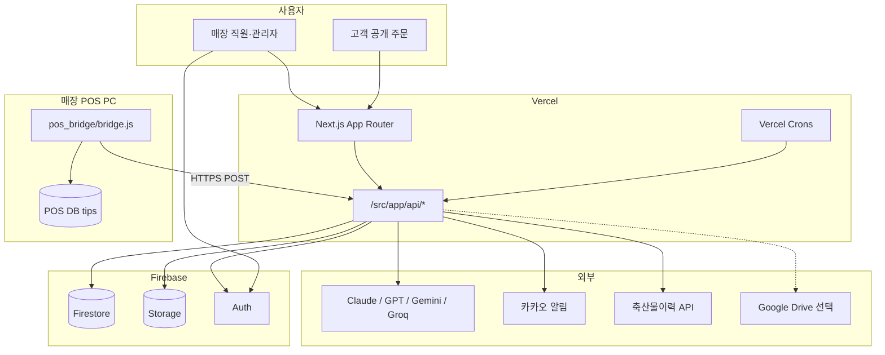
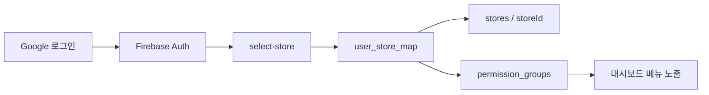

# Pitaya OS — 아키텍처

정육·식자재 매장 운영용 **Next.js 16 + Firebase + Vercel** 웹앱.  
상세 모듈 문서: [docs/README.md](docs/README.md)

**프로덕션:** https://pitaya-osv1.vercel.app

---

## 1. 시스템 전체 구조



---

## 2. 코드 디렉터리 (요약)

```
pitaya-os/
├── src/
│   ├── app/
│   │   ├── dashboard/     # 인증 후 관리 화면
│   │   ├── order/[token]/ # 고객 공개 주문
│   │   ├── api/           # REST·크론 엔드포인트
│   │   └── login, select-store …
│   ├── components/        # UI (purchases, dashboard …)
│   ├── context/           # StoreContext 등
│   └── lib/               # 비즈니스 로직·연동
├── pos_bridge/            # POS PC Node 스크립트 (bridge.js)
├── scraper/               # 시세 스크래퍼 (빌드 시 설치)
├── docs/                  # 이 문서들
├── vercel.json            # 함수 타임아웃·Vercel 크론
└── .github/workflows/     # main 푸시 → Vercel 배포
```

---

## 3. 비즈니스 모듈 맵

| 모듈 | 대시보드 경로 | API·lib | 문서 |
|------|---------------|---------|------|
| **대시보드·매출** | `/dashboard`, `/dashboard/report/*` | `/api/dashboard/*`, `/api/pos/sync` | [sales-and-reports](docs/modules/sales-and-reports.md) |
| **AI 매입** | `/dashboard/report/purchases/*` | `/api/purchases/*`, `src/lib/purchase*` | [purchases](docs/modules/purchases.md) |
| **공개 주문** | `/dashboard/public-orders` | `/api/public-orders/*`, `/api/public/orders/*` | [public-orders](docs/modules/public-orders.md) |
| **POS 연동** | (설정·일마감) | `/api/pos/*`, `pos_bridge/` | [pos-bridge](docs/modules/pos-bridge.md) |
| **저울·품목코드** | `/dashboard/scale` | `/api/scale/*` | pos-bridge 문서 참고 |
| **고객·PII** | `/dashboard/customers` | `/api/customers/*` | — |
| **인사** | `/dashboard/hr/*` | `/api/hr/*` | — |
| **위생** | `/dashboard/hygiene` | `/api/hygiene/*` | — |
| **AI 대화** | `/dashboard/ai` | `/api/ai`, `/api/conversations` | — |
| **유통기한** | 캘린더·AI채팅·매입 | `src/lib/expiryReminder/*` | [expiry-reminder](docs/modules/expiry-reminder.md) |
| **사이니지** | `/dashboard/signage` | `/api/signage/*` | — |
| **설정** | `/dashboard/settings/*` | `/api/store`, `/api/permissions` | — |

---

## 4. 인증·매장·권한



| 개념 | 컬렉션·파일 |
|------|-------------|
| 사용자 | `users` |
| 매장 | `stores` |
| 매장–유저 매핑 | `user_store_map` |
| 권한 그룹 | `permission_groups` (master > 관리자 > 사용자 > 직원) |
| 클라이언트 헤더 | `src/lib/getAuthHeaders.ts` |

---

## 5. 데이터 저장소

| 저장소 | 용도 |
|--------|------|
| **Firestore** | 운영 데이터 (매입, 일마감, 주문 세션 등) |
| **Firebase Storage** | 매입 원본, 공개주문 이미지, 매장 이미지 |
| **POS SQL Server** | 포스 원천 (브릿지만 접근) |

컬렉션 전체 목록: [docs/data/firestore-collections.md](docs/data/firestore-collections.md)

---

## 6. 배포·크론

| 경로 | 설명 |
|------|------|
| `git push main` | GitHub Actions → `vercel deploy --prod` |
| 수동 | `npx vercel deploy --prod --yes` |
| Vercel Cron | `vercel.json` → `/api/cron/*` |
| GitHub Schedule | 위생·예측 AI 슬롯 등 → POST 크론 API |

상세: [docs/ops/deploy.md](docs/ops/deploy.md), [docs/ops/cron.md](docs/ops/cron.md)

---

## 7. 시간대 (필수)

**모든 영업일·알림 해석은 KST (`Asia/Seoul`).**  
서버 `toISOString()`은 UTC → 사용자 표기 시 +9시간.  
유틸: `src/lib/dateUtils.ts` · 포스: `pos_bridge/bridge.js`  
에이전트 규칙: `AGENTS.md`, `.cursor/rules/kst-timezone.mdc`

---

## 8. AI 제공자

라우팅: `src/lib/aiRouter.ts`, 폴백: `aiProviderFallback.ts`  
엔드포인트: `/api/ai`, `/api/ai/claude`, `/api/ai/gpt`, …  
매입 OCR: `ensembleOcr.ts`, `purchaseOcrRules.ts`

---

## 9. 알림

| 채널 | lib |
|------|-----|
| 카카오 | `src/lib/kakao/*` |
| 앱 내 | `notifications` 컬렉션 |
| Solapi/DHN | `src/lib/solapi`, `dhn` (알림톡) |

카카오 연동: 설정 → 내 계정. Vercel `KAKAO_*` env 필요.
