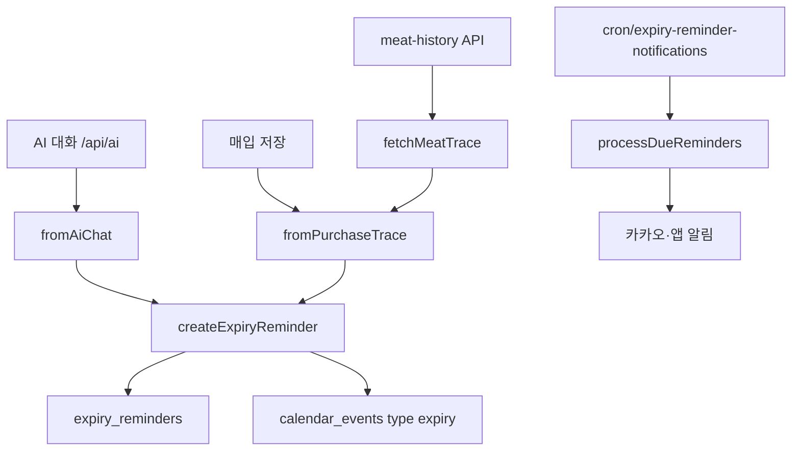

# 유통기한 알림 (Expiry Reminder)

모듈 경로: `src/lib/expiryReminder/` — AI 채팅·매입 이력·크론에서 공통 사용.

## 진입 경로

## 파일

| 파일 | 역할 |
|------|------|
| `types.ts`, `constants.ts` | 타입·D-7/D-3/D-1 |
| `parseExpiryMessage.ts` | 자연어·AI JSON 파싱 |
| `createExpiryReminder.ts` | Firestore 등록 |
| `processDueReminders.ts` | 만기 알림 발송 |
| `fromAiChat.ts` | AI 대화 채널 |
| `fromPurchaseTrace.ts` | 매입 traceNo 채널 |

## 크론

`vercel.json`: 매일 `0 0 * * *` → `/api/cron/expiry-reminder-notifications`

## 관련

- [AI 매입](purchases.md) — 저장 시 `registerExpiryRemindersFromPurchase`
