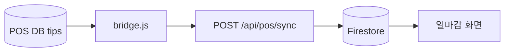

# POS 브릿지 (pos_bridge)

매장 **POS PC**에서 SQL Server(포스 DB)를 읽어 Pitaya API로 업로드. Pitaya **일마감·POS별 상세**의 데이터 원천.

## 배치 구조



## POS PC 원격 작업 (Cursor SSH)

에이전트·운영자가 Mac에서 POS PC에 직접 접속할 때:

```bash
ssh -p 2223 -i ~/.ssh/pitaya_pos User@pitayaos.iptime.org
```

| 항목 | 값 |
|------|-----|
| 포트 | **2223** (Cursor 전용) |
| 금지 | **2222** — 다른 용도 |
| 쉘 | PowerShell |
| 작업 경로 | `C:\pitaya-os` |

- 명령은 **한 줄씩** 실행 후 출력 확인
- Node **v18.20.4**, Python **3.14** (`python`)
- 규칙 파일: `.cursor/rules/pos-pc-ssh.mdc`

## 설치 위치 (포스 PC)

```
C:\pitaya-os\
  bridge.js      ← repo pos_bridge/bridge.js 동기화
  .env           ← DB, STORE_ID, FIREBASE_SERVICE_ACCOUNT_KEY …
```

## .env 예시

```
DB_PORT=18973
DB_DATABASE=tips
STORE_ID=STR-1779194754785
PITAYA_URL=https://pitaya-osv1.vercel.app
```

## DB (POS PC 로컬)

| DB | 연결 |
|----|------|
| POS (MS SQL) | `localhost:18973`, DB=`tips`, user=`sa` |
| 통화매니저 (SQLite) | `C:\Program Files\통화매니저\KPD.dat` — Python으로 읽기 |

## 자주 쓰는 명령

| 명령 | 설명 |
|------|------|
| `node bridge.js check-tables` | DB 연결·테이블 확인 |
| `node bridge.js today` | 오늘 데이터 동기화 |
| `node bridge.js realtime` | 실시간(스케줄러) |
| `node bridge.js migrate YYYY-MM-DD YYYY-MM-DD` | 기간 재마이그레이션 |
| `node bridge.js --dry-run` | 업로드 없이 출력만 |

## Pitaya API

| API | 역할 |
|-----|------|
| `POST /api/pos/sync` | 일마감·상세·고객매출 → Firestore |
| `POST /api/pos/sync-customers` | 거래처 |
| `POST /api/pos/sync-employees` | 직원 |
| `POST /api/pos/sync-goods` | 저울 품목 → `scale_codes` |

## Firestore 결과 (요약)

| 컬렉션 | 설명 |
|--------|------|
| `daily_reports` | `pos_{storeId}_{date}` — 일마감 화면 |
| `pos_daily_sales` | 일별 요약 |
| `pos_sales_detail` | 바코드별 상세 |
| `pos_sync_log` | 동기화 이력 |

## 작업 체크리스트

루트 `pos_bridge/작업순서_POS별내역표시.txt` 참고:

1. `git push` → Vercel 배포
2. 포스 PC `bridge.js` 교체
3. `migrate`로 기간 재적재

## 시간대

브릿지 로그·“오늘” 날짜는 **KST** (`getKSTTodayYMD`).  
상세: `AGENTS.md`

## 관련

- [매출·일마감](sales-and-reports.md)
- [Firestore](../data/firestore-collections.md)
