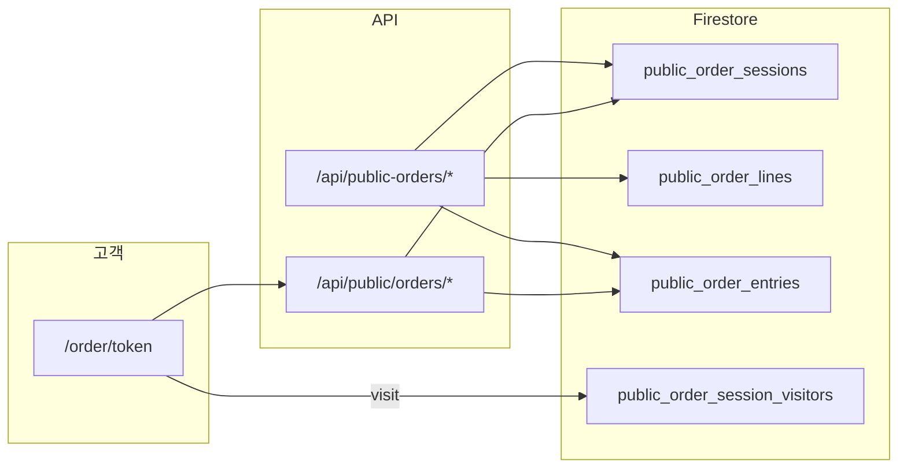

# 공개 주문 (Public Orders)

고객이 링크(`/order/[token]`)로 접속해 품목을 담고 주문·매장은 대시보드에서 접수·상태 관리.

## 구조

## 화면

| 경로 | 역할 |
|------|------|
| `/order/[token]` | 고객 주문 UI |
| `/order/[token]/history` | (비활성) 주문 페이지로 리다이렉트 — 이력은 매장 대시보드에서만 확인 |
| `/dashboard/public-orders` | 세션·주문 관리·상태 변경 |

## 주문 상태 (`public_order_entries`)

| status | 표시 |
|--------|------|
| `unconfirmed` | 미확인 |
| `accepted` | 접수 |
| `ready` | 준비완료 |
| `completed` | 수령완료 |

## 주요 lib·API

| 파일 | 역할 |
|------|------|
| `src/lib/publicOrders.ts` | 메시지 마스킹·포맷 |
| `src/lib/publicOrderNotify.ts` | 매장 알림 |
| `src/lib/publicOrderKakaoHook.ts` | 카카오 훅 |
| `src/lib/publicOrderChatExecutor.ts` | AI 채팅 주문 조작 |
| `src/app/api/public/orders/[token]/submit/route.ts` | 고객 제출 |
| `src/app/api/public/orders/[token]/visit/route.ts` | 방문자 수 |
| `src/app/api/public-orders/entries/[entryId]/route.ts` | PATCH status |

## 가격·단위

- `priceUnitLabel`: 화면 표시 단위
- `unit`: 실제 주문·재고 단위

## 알림 메시지 예

`김 ** 010****5678 삼겹살 2kg 주문되었습니다. 감사합니다.`

## 관련

- [Firestore](../data/firestore-collections.md)
