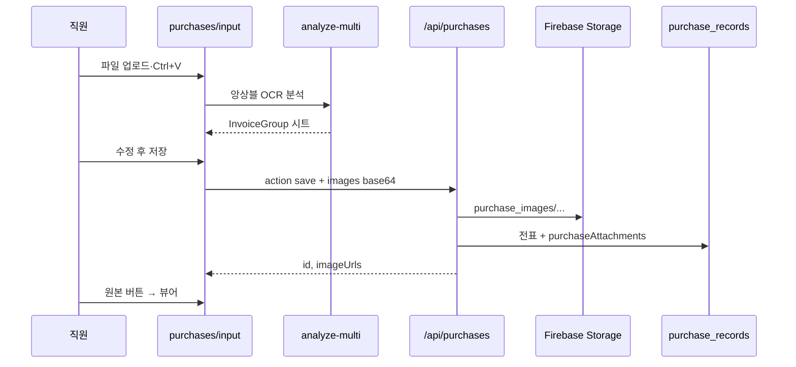

# AI 매입 (Purchases)

거래명세·세금계산서 이미지/PDF를 AI OCR로 분석하고, 수정 후 Firestore에 저장·원장 조회·이력추적·유통기한 연동.

## 사용자 흐름



## 화면

| 경로 | 역할 |
|------|------|
| `/dashboard/report/purchases/input` | AI 매입 등록 (시트 + AI 패널) |
| `/dashboard/report/purchases/ledger` | 매입 원장·원본 보기 |
| `/dashboard/report/purchases/view` | 조회 |
| `/dashboard/report/purchases/trace-*` | 이력번호·추적 |
| `/dashboard/report/purchases/price-analysis` | 단가 분석 |

## 주요 파일

| 파일 | 역할 |
|------|------|
| `src/components/purchases/PurchaseSheet.tsx` | 편집 시트·원본 버튼 |
| `src/components/purchases/PurchaseDocumentViewer.tsx` | 원본 이미지/PDF 뷰어 |
| `src/components/purchases/AIPurchasePanel.tsx` | AI 채팅 패널 |
| `src/lib/purchaseAttachments.ts` | Storage 메타·`resolveGroupAttachments` |
| `src/lib/ensembleOcr.ts` | 다중 모델 OCR |
| `src/lib/purchasePostProcess.ts` | 합계·품목 후처리 |
| `src/lib/meatTrace/fetchMeatTrace.ts` | 이력번호 → 유통기한 |
| `src/app/api/purchases/route.ts` | 저장·조회·삭제 |
| `src/app/api/purchases/analyze-multi/route.ts` | 분석 (60s) |

## 저장 데이터 (`purchase_records`)

| 필드 | 설명 |
|------|------|
| `supplierName`, `items[]`, `totalAmount` … | 전표 본문 |
| `imageUrls` | Storage URL 배열 (레거시 호환) |
| `purchaseAttachments` | `{ url, name, mimeType }[]` |
| `storeId`, `uid`, `createdAt` | 메타 |

저장 시 이력번호(12자리+) 품목은 `registerExpiryRemindersFromPurchase` → `expiry_reminders` + 캘린더.

## API

```
POST /api/purchases
  { action: "save", extractedData, uid, storeId, images: [{ name, content, mimeType }] }

GET /api/purchases?storeId=&startDate=&endDate=
```

## 외부 API

- 축산물 이력: `/api/external/meat-history` → `fetchMeatTrace`

## 관련 문서

- [유통기한](expiry-reminder.md)
- [Firestore](../data/firestore-collections.md)
